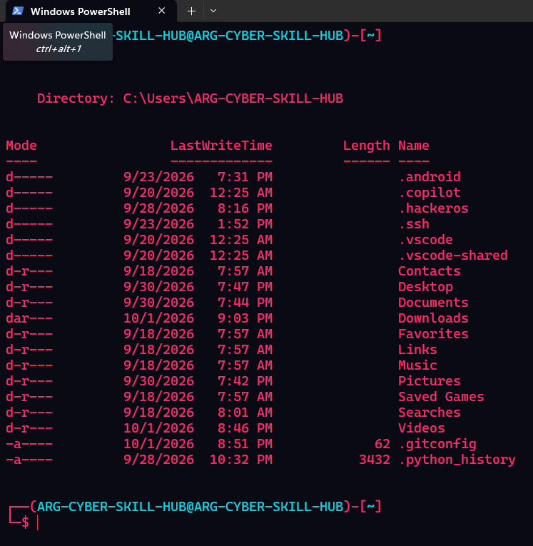
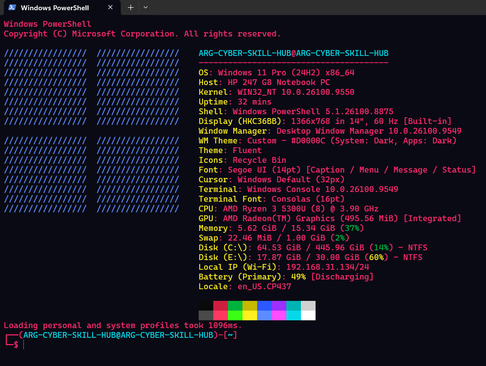
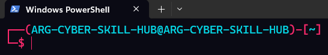

# ⚡ PowerShell Ultimate Customizer

A Windows customization utility that combines:

- 🎨 Oh My Posh
- 🚀 Fastfetch
- 🌧️ Rainmeter
- ✨ Desktop visual customization
- 🖥️ PowerShell customization
- 🌈 Custom themes and colors

The goal is to provide a complete futuristic PowerShell + desktop
customization experience from a single application.

---

## ✨ Features

### 🎨 Oh My Posh

Customize PowerShell with:

- Custom themes
- Colors
- Icons
- Git information
- System information
- Custom PowerShell prompt

---
## 📸 Screenshots

### PowerShell


### Fastfetch


### Desktop

### 🚀 Fastfetch

Display system information directly in PowerShell.

Example:

```text
╭────────────────────────────────────╮
│          SYSTEM INFORMATION        │
├────────────────────────────────────┤
│ OS       Windows 11                │
│ CPU      Intel / AMD               │
│ RAM      16 GB                     │
│ Shell    PowerShell                │
│ Terminal Windows Terminal          │
╰────────────────────────────────────╯
```
🌈 Dynamic Window Visuals
The project can also provide visual customization around
application windows, such as:
- Colored borders
- Neon-style effects
- Custom colors
- Dynamic visual effects
Note: Window-border effects depend on the implementation used by
the application and are separate from standard Rainmeter widgets.

📥 Installation
Method 1 — Download the EXE
1. Open the project's GitHub Releases page.
2. Download the latest:
PowerShell-Ultimate-Customizer.exe

3. Save the file anywhere on your Windows PC.
4. Right-click the .exe.
5. Select Run as administrator if the application requests
   administrator privileges.

🗑️ Uninstallation
Use the Windows application uninstall process if the project
provides an installer.
If the project is distributed as a portable .exe, remove the
application files and manually revert any PowerShell profile changes
made by the tool.
Before removing profile changes, inspect:

## 🚀 Quick Start

1. **Open PowerShell** on your computer.
2. **Run the following command** to open your profile script in Notepad:

```powershell
notepad $PROFILE
```

## 📝 Next Steps
* If the file does not exist, Notepad will ask if you want to create a new one. Click **Yes**.
* Paste your custom aliases, functions, or scripts into the file.
* **Save** and close Notepad.
* Restart PowerShell or run `. $PROFILE` to apply your changes.
